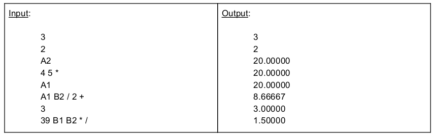

# Programming​ ​ Challenge

A​ ​ spreadsheet​ ​ consists​ ​ of​ ​ a ​ ​ two-dimensional​ ​ array​ ​ of​ ​ cells,​ ​ labeled​ ​ `A1`,​ ​ `A2`,​ ​ etc.​ ​ Rows​ ​ are
identified​ ​ using​ ​ letters,​ ​ columns​ ​ by​ ​ numbers.
Each​ ​ cell​ ​ contains​ ​ either​ ​ a ​ ​ sign​ ​ integer​ ​ (its​ ​ value)​ ​ or​ ​ an​ ​ expression.​ ​ Expressions​ ​ contain​ ​ integers,
cell​ ​ references,​ ​ and​ ​ the​ ​ operators​ ​ `+`,​ ​ `-`,​ ​ `*`,​ ​ `/`​ ​ with​ ​ the​ ​ usual​ ​ rules​ ​ of​ ​ evaluation​ ​ – ​ ​ note​ ​ that​ ​ the
input​ ​ is​ ​ RPN​ ​ and​ ​ should​ ​ be​ ​ evaluated​ ​ in​ ​ stack​ ​ order.

## Description

Write​ ​ a ​ ​ program​ ​ in​ ​ vanilla​ ​ Java​ ​ 8 ​ ​ to​ ​ read​ ​ a ​ ​ spreadsheet​ ​ from​ ​ `stdin`,​ ​ evaluate​ ​ the​ ​ values​ ​ of​ ​ all​ ​ the
cells,​ ​ and​ ​ write​ ​ the​ ​ output​ ​ to​ ​ `stdout`.​ ​ Your​ ​ program​ ​ should​ ​ detect​ ​ cyclic​ ​ dependencies​ ​ in​ ​ the​ ​ input data,​ 
report​ ​ these​ ​ in​ ​ a ​ ​ sensible​ ​ manner,​ ​ and​ ​ exit​ ​ with​ ​ a ​ ​ non-zero​ ​ exit​ ​ code.

The​ ​ spreadsheet​ ​ input​ ​ is​ ​ defined​ ​ as​ ​ follows:

 - Line​ ​ 1 ​ ​ - ​ ​ the​ ​ width​ ​ `N`​ ​ of​ ​ the​ ​ spreadsheet
 - Line​ ​ 2 ​ ​ - ​ ​ the​ ​ height​ ​ `M`​ ​ of​ ​ the​ ​ spreadsheet
 - `N*M`​ ​ lines​ ​ each​ ​ containing​ ​ an​ ​ expression​ ​ which​ ​ is​ ​ the​ ​ value​ ​ of​ ​ the​ ​ corresponding​ ​ cell
   (cells​ ​ enumerated​ ​ in​ ​ the​ ​ order​ ​ `A1,​ ​ A2,​ ​ ...,​ ​ A{N},​ ​ B1,​ ​ ...`).

You​ ​ can​ ​ assume​ ​ that​ ​ there​ ​ are​ ​ no​ ​ more​ ​ than​ ​ 26​ ​ rows​ ​ (`A-Z`)​ ​ in​ ​ the​ ​ spreadsheet;​ ​ however​ ​ there
can​ ​ be​ ​ any​ ​ number​ ​ of​ ​ columns​ ​ (`1-N`).

Your​ ​ program​ ​ must​ ​ output​ ​ its​ ​ data​ ​ in​ ​ the​ ​ same​ ​ format,​ ​ but​ ​ each​ ​ cell​ ​ should​ ​ be​ ​ reduced​ ​ to​ ​ a ​ ​ single
floating-point​ ​ value​ ​ (`String.format(“%.5f”,​ ​ val)`).

## Test​ ​ vector

## Additional​ ​ requirements

Final​ ​ solution​ ​ should​ ​ only​ ​ use​ ​ the​ ​ standard​ ​ Java​ ​ library​ ​ and​ ​ be​ ​ hosted​ ​ on​ ​ Github.​ ​ Gradle​ ​ script
should​ ​ simplify​ ​ build​ ​ process​ ​ and​ ​ the​ ​ main​ ​ usage​ ​ scenario​ ​ should​ ​ be​:
  - > gradle​ ​-q run​ < input.txt > output.txt
  
The `-q` flag must be added in order to write only the solution in the output.txt,
otherwise it will include the gradle compilation statuses.

--

